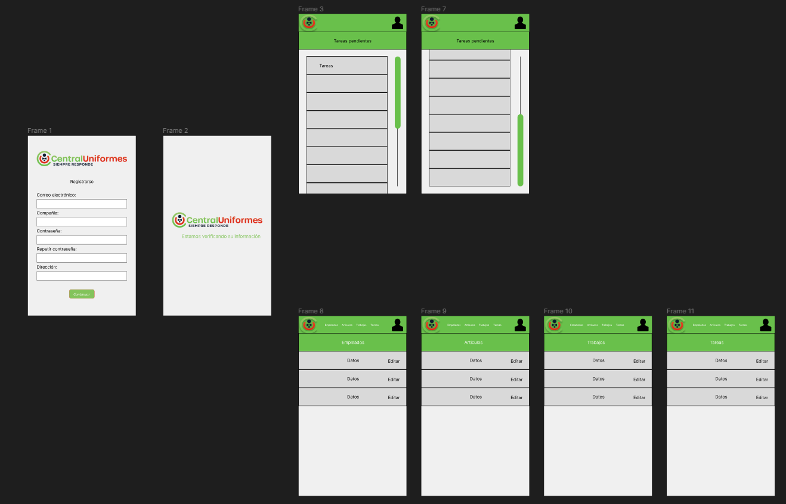
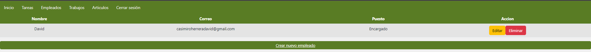

# Documentación

## Introducción

Esta aplicación surge de la necesidad de asignar tareas a los empleados de la empresa CentralUniformes. La idea es que uno o varios encargados asignen tareas al resto de empleados de la empresa.

Por su parte, los empleados solo podrán ver la información de las tareas para así poder reaalizarlas.

---

## Modelo de datos

En este apartado se explicarán las entidades del modelo, así como sus atributos y las relaciones entre las mismas.

Para empezar, aquí están los diferentes diagramas de datos.

---

### Modelo Entidad/Relacion

---

### Modelo Relacional

---

### Modelo UML

---

### Entidades y atributos

Las entidades de este modelo de datos son las siguientes:

- Empleados: Se trata de una tabla que almacena la información de los empleados de la empresa. Sus atributos son los siguientes:

  - Id.
  - Name: almacena el nombre del empleado.
  - Email: almacena el correo electrónico del empleado.
  - Password: almacena la contraseña del empleado.
  - Puesto: almacena el rol del empleado en la empresa, pudiendo ser este empleado o encargado.

---

- T_trabajo: Se trata de una tabla maestra en la que se almacenan los diferentes tipos de trabajos que se pueden realizar en una prenda. Sus atributos son los siguientes:

  - Id.
  - Nombre: almacena el nombre del trabajo.
  - Descripción: almacena una breve descripción del trabajo.

---

- Articulos: Se trata de una tabla que almacena la información de las diferentes prendas de ropa con las que trabaja la empresa. Sus atributos son los siguientes:

  - Id.
  - Nombre: almacena el nombre la prenda.
  - Talla: almacena la tall la prenda.
  - Color: almacena el color la prenda.
  - Precio: almacena el precio la prenda.
  - Descripción: almacena una breve descripción de la prenda.

---

- Tareas: Se trata de una tabla que almacena la información de las tareas que la empresa tiene y asigna a sus empleados. Sus atributos son los siguientes:
  - Id.
  - T_trabajo: Es una foreign key que referencia al id de la tabla T_trabajo.
  - Id_empleado: Es una foreign key que referencia al id de la tabla Empleados.
  - Id_articulo: Es una foreign key que referencia al id de la tabla Articulos.
  - Unidades: Indica la cantidad de prendas a las que hay que relizar el trabajo.
  - Descripción: almacena una breve descripción de la tarea.

---

### Relaciones

La tabla Empleados tiene una relación de uno a muchos con la tabla Tareas, al igual que las tablas T_trabajo y Articulos.

Un empleado puede no tener asignada ninguna tarea o puede tener muchas, lo mismo ocurre con las tablas T_trabajo y Articulos que también pueden relacionarse con ninguna o muchas tareas. En cambio las tareas deben relacionarse con un y solo un empleado, tipo de trabajo y articulo.

Para eliminar cualquier empleado, tipo de trabajo o articulo es necesario haber eliminado anteriormente todas las tareas con las que esten relacionadas, de lo contrario el registro no se eliminará.

---

### Migraciones

Dado que utilizamos Laravel para el manejo de las bases de datos no es necesario adjuntar un SQL del modelo ya que bastará con ejecutar el comando "php artisan migrate" para crear las tablas de la base de datos.

---

## Requisitos de Usuario

 - R1. La apliación que haremos será para escritorio.

 - R2. Los usuarios que acceden necesitan introducir un email y una contraseña, tras lo cual acceden directamente al menú principal.
 
 - R3. El encargado será quién registre a los nuevos empleados.

 - R4. La aplicación debe permitir a los encargados asignar tareas a los empleados.
 
 - R5. La app tendrá un menú superior

    - R5.1. Este menú estará presente en siempre en la aplicación, salvo en la pantalla de login.

    - R5.2. El menú será diferente dependiendo del rol del usuario.

    - R5.3. El menú del encargado permitirá aceder a las diferentes tablas, la interfaz de inicio, un documento de ayuda y tendrá un botón para cerrar sesión.

    - R5.4. El menú del empleado permitirá aceder a la interfaz de inicio, un documento de ayuda y tendrá un botón para cerrar sesión.

  - R6. El empleado tendrá acceso a una lista en la que verá las tareas que hay que realizar.

  - R7. Si existe un problema de acceso a base de datos se intentará dar información al usuario final del origen "concreto" del problema.
  
  - R8. Si existe cualquier otro problema que el usuario pueda resolver se intentará que el usuario entienda que ha fallado.
  
  - R9. CRUDS
  
    - R9.1. El encargado podrá crear artículos, tipos de trabajo, registrar nuevos empleados y tareas.
  
    - R9.2. El encargado podrá editar artículos, tipos de trabajo y tareas, pero no a los empleados.
  
    - R9.3. El encargado podrá eliminar artículos, tipos de trabajo, empleados y tareas.
    
    - R9.4. Cada tarea debe estar relacionada con el empleado que la realiza, el artículo que se emplea para ella y el tipo de trabajo que se realiza en la prenda.

    - R9.5. Para poder borrar a un empleado, artículo o tipo de trabajo es necesario que no esten relacionados con ninguna tarea.
  
  - R10. El empleado normal tendrá acceso a un listado de las tareas marcadas, pero no podrá editarla ni eliminarlas.
  
---

## Casos de Usos

Este es el diagrama de casos de uso.

## Diseño inicial

---

Este fue el diseño inicial de esta aplicación

https://www.figma.com/file/qPUiN57e3iq2NjPwA43Z5i/Untitled?t=MAMsbkSD7btdchxN-6

## Usabilidad

---

### Botones grandes.

Es importante que el usuario no tenga dificultades para hacer click en los botones, esto se puede evitar haciendo los botones más grandes.

---

### Pocas opciones para el usuario.

Es recomendable que el usuario tenga el menor número de opciones posibles para que así no pierda tiempo decidiendo lo que quiere hacer.

---

### Separación de la información.

Esta aplicación separa la información en diferentes tablas para que el usuario pueda encontrarla e identificarla claramente.

---

### Validación de formularios y alertas

Mediante la validación de formularios y el uso de alertas se puede informar al usuario de que está cometiendo un error. De está forma se consigue que el usuario entienda con facilidad lo que está pasando en la aplicación.

---

### Retroalimentación

Cada vez que el empleado elimina un registro automáticamente se recarga el listado para mostrarle los cambios. De la misma, manera al completar el formulario de creación o edición de un registro se redirige al usuario a la pantalla en la que se muestran todos los registros.

---

### Simplicidad del diseño

Las interfaces presentan pocas opciones para que el usuario pueda entender rápidamente para que sirve cada botón de la interfaz.

Formulario de inicio de sesión

Listado de tareas para el usuario:

Modificación de las tablas:

---
### Utilidad

Cumple con las funciones para las cuales ha sido diseñada. Permite crear artículos, tareas trabajos y registrar empleados. Además, permite a los encargados asignar tareas a los empleados, para que luego los mismos sean capaces de obtener la información para realizar las mismas.

---
## Manuales

### Manual de instalación

Para instalar la aplicación por completo tenemos que seguir los siguientes pasos:

- Abrimos el la consola de Visual Studio Code e introducimos el comando "git clone https://github.com/davidcasimiro77/Laravel-React.git"

- A continuación, nos situamos en la carpeta "backend" y ejecutamos los comandos "composer install", "php artisan migrate" y "php artisan serve". De esta manera instalaremos las dependecias, crearemos las tablas de nuestra base de datos y activaremos el backend.

- El siguiente paso es activar Apache y MySQL en Xampp para usar como el host de nuestra aplicación.

- Por último, nos situamos en la carpeta "frontend" y ejecutamos de nuevo el comando "npm install" y luego "npm start" para instalar las dependencias iniciar la aplicación.

---

## Metodología de trabajo

Gracias a la interfaz de proyectos de GitHub, la cual se ve en la captura superior, he podido organizar mi trabajo en esta aplicación mediante la creación de diferentes tareas.

## Pila tecnológica

Para el desarrollo de esta aplicación hemos empleado Laravel y PHP para el manejo de datos en el back-end, y Eloquent para el ORM.

Para el front-end hemos empleado React

## Comparación de tecnologías

A continuación realizare una breve comparativa entre las tecnologías que he empleado y alguna otra de entre las más conocidas.

### Laravel y Node

---

Tanto Laravel como Node son aplicaciones de código abierto. En el front-end, Laravel emplea JavaScript y PHP en el back-end. En Node se utiliza JavaScript tanto en el frontend como en el backend.

Una de las grandes diferencias entre Laravel y Node es que Laravel utiliza migraciones para crear las bases de datos con el comando "php artisan migrate".
